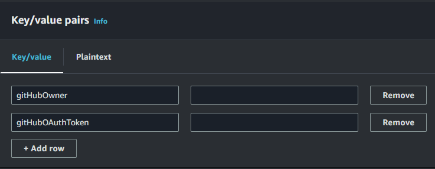

# OSU Capstone AWS Template

## Initial Setup

1. In the Github page for the template, press the `Use this template` button. Select the visibility level and press `create repository from template`.
2. Now Clone it to your local machine

## Github OAuth Token setup

1. In the upper-right corner of any page, click your profile photo, then click Settings.
2. In the left sidebar, click  Developer settings.
3. In the left sidebar, under Personal access tokens, click Tokens (classic).
4. Click Generate new token (classic).
5. Optionally, under Token name, enter a name for the token.
6. Under Expiration, select an expiration for the token. (If you do not want to have to go through this process again, I recommend having no expiration date.)
7. Select the scopes you'd like to grant this token. To use your token to access repositories from the command line, select repo. A token with no assigned scopes can only access public information. I chose to give the token full permission for all scopes to remove any chance for future issues. For more information, see ["Available scopes"](https://docs.github.com/en/enterprise-server@3.4/apps/building-oauth-apps/scopes-for-oauth-apps#available-scopes).
8. Click Generate token.
9. Copy the token for safekeeping until you are able to create a secret in AWS Secrets Manager to house it. 

## AWS SecretsManager Setup

1. Because we are storing sensitive information in Secrets Manager, please respect your fellow classmates and do not attempt to view their secret. Whenever a secret is viewed the last retrieved date will update, so if you have not accessed your token and the date has changed, you may want to revoke that token's access and create a new one. 
2. Navigate to the [AWS login page](http://login.oregonstate.edu/apps/aws)
3. Select the role that you will be housing your project in. I believe for most that will be Shibboleth-aws-capstone-admin
4. Click Sign In
5. In the search bar type in Secrets Manager
6. Click on Secrets Manager
7. Click on the orange "Store a new secret" button
8. Underneath "Secret type" select Other type of secret
9. You will be creating two separate keys: gitHubOwner and gitHubOAuthToken

10. The value for gitHubOwner should be your github profile name
11. The value for gitHubOAuthToken should be the token you copied at the end othe Github OAuth Token setup
12. Click the orange "Next" button in the bottom right corner
13. For "Secret name" put <REPLACE_PROJECT_NAME>-githubPersonalAccess
14. A description is not required, but you may add one if you want
15. Click the orange "Next" button in the bottom right corner for step 2 & 3
16. Check to make sure everything looks correct on the Review page and click on the orange "Store" button when you are ready to create your secret

## Full Configuration Instructions

Note: Each service folder has its own README file for specific setup directions and notes.  

1. From the root folder, fill out the project name in the **package.json** file. 
2. From the root folder, run `npm install` to install your linting packages.
3. Navigate to the back-end folder and follow the instructions.
4. Navigate to the buildspecs folder and follow the instructions.
5. Commit changes to Github.
6. Navigate to the pipeline folder and follow the instructions.
7. Verify your CICD has completed successfully from the AWS Cloudformation console.  Once it has completed building, your project stack will automatically start building.  
8. Verify your project has built successfully by going to the AWS Codepipeline console and finding your project CICD pipeline.

## Git Management

With proper setup, the CI/CD process should be automated. This process requires managing sourcecode through git and the use of webhooks to trigger that automation through the AWS CodePipeline. 

## Serverless Commands

### Full Deploy

You can deploy the serverless project by merging changes into your CI/CD targeted github branch or manually in your cli. 
`sls deploy --aws-profile <REPLACE_AWS_PROFILE> --stage <REPLACE_STAGE>` 
**NOTE:** you will need your AWS_PROFILE that you setup in the CI/CD Pipeline instructions.

### Partial Deploy

At times during development you may wish to deploy changes to just one lambda. To do this run the following: 
`sls deploy function --aws-profile <REPLACE_AWS_PROFILE> --stage <REPLACE_STAGE> -f <REPLACE_FUNCTION_NAME>` 